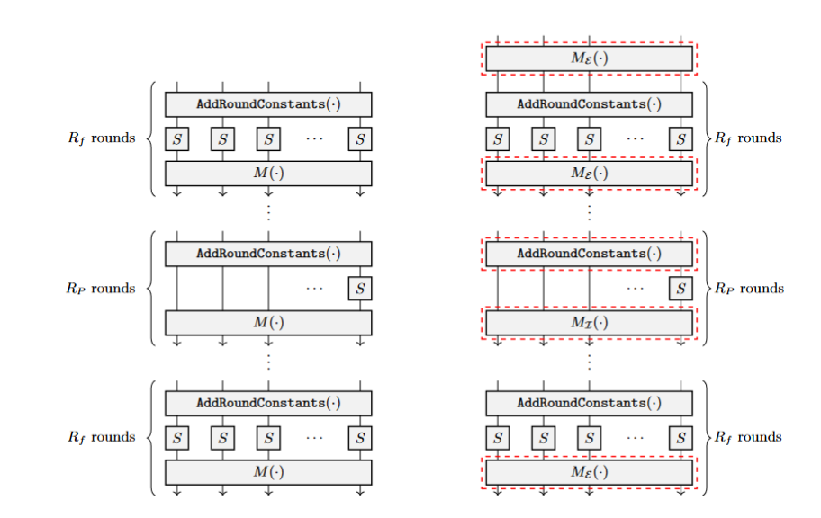

# Poseidon and Poseidon2 for Noir

This repository contains the following Noir crates in the respective folders:

- [poseidon](poseidon): An implementation of the zk-friendly hash function [Poseidon](https://eprint.iacr.org/2019/458.pdf)
- [poseidon2](poseidon2): An implementation of Poseidon's successor, [Poseidon2](https://eprint.iacr.org/2023/323.pdf)
- [crypto_math](crypto_math) (weiß jemand nen besseren namen :'( ): A library crate that implements helper functions for cryptographic primitives

Poseidon and Poseidon2, in contrast to traditional hash constructions like SHA-256, utilize low-degree round functions (S-box) $x^d$ to minimize the necessary constraints inside a zk-circuit. In the case of Noir's native curve BN254, the exponent in the round function is $d=5$. The implementations utilize modern optimizations (in contrast to the existing Poseidon implementation in Noir's standard library) with all advances in cryptoanalysis in mind.

You can see the designs and the difference of Poseidon and Poseidon2 in the following picture:

> we obtained the picture from the [Poseidon2 Paper](https://eprint.iacr.org/2023/323.pdf)

For a more in-depth discussions of the two algorithms, have a look in the sub-folders.

## Performance

Similar to the Poseidon implementation in Noir's standard library, we provide a Poseidon implementation for state sizes $t \in [2, 16]$. Poseidon2 has an internal state size $t\in \\{2,3,4t^\prime,\dots,24\\} \text{ for } t^\prime \in \mathbb{N}$, therefore we provide an implementation for state sizes $t \in \\{2,3,4,8,12,16\\}$. The following table shows the constraints obtained by `nargo info` for our implementations and the corresponding hashes from the standard library.

| #   | Poseidon old | Poseidon new | Poseidon2 |
| --- | ------------ | ------------ | --------- |
| 2   | 586          | 586          | 586       |
| 3   | 2183         | 2098         | 2094      |
| 4   | 2353         | 2305         | 2313      |
| 5   | 2833         | 2507         | -         |
| 6   | 3059         | 2795         | -         |
| 7   | 3532         | 3031         | -         |
| 8   | 3877         | 3283         | 3139      |
| 9   | 4076         | 3551         | -         |
| 10  | 4123         | 3835         | -         |
| 11  | 4948         | 4135         | -         |
| 12  | 4751         | 4451         | 3995      |
| 13  | 5539         | 4783         | -         |
| 14  | 6388         | 5131         | -         |
| 15  | 5813         | 5495         | -         |
| 16  | 6581         | 5875         | 4883      |

# Usage

Have a look in the respective sub-folders for instructions on how to use the libraries and installation.

## Disclaimer

This is **experimental software** and is provided on an "as is" and "as available" basis. We do **not give any warranties** and will **not be liable for any losses** incurred through any use of this code base.
