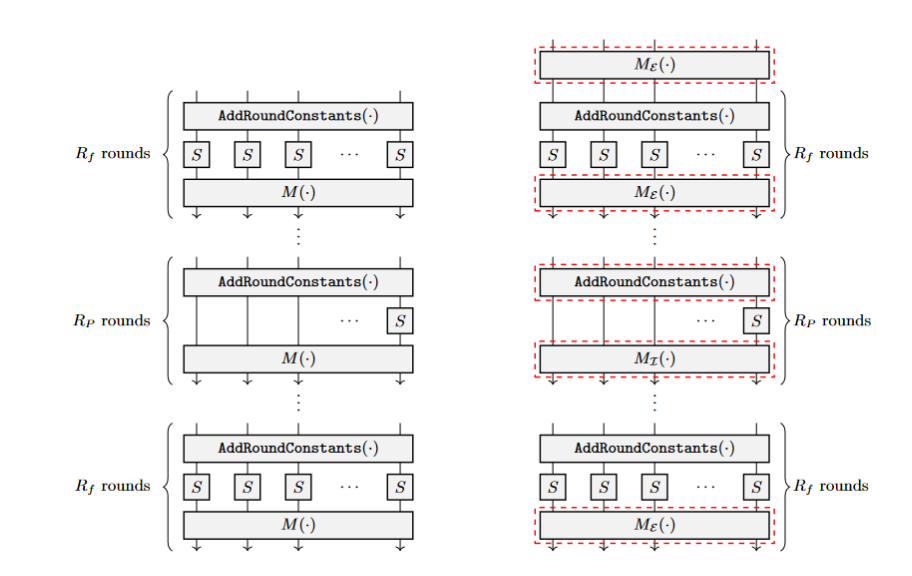

# Poseidon and Poseidon2 for Noir

[](https://opensource.org/licenses/MIT)

This repository contains the following Noir crates in the respective folders:

- [poseidon](poseidon): An implementation of the zk-friendly hash function [Poseidon](https://eprint.iacr.org/2019/458.pdf)
- [poseidon2](poseidon2): An implementation of Poseidon's successor, [Poseidon2](https://eprint.iacr.org/2023/323.pdf)
- [hash_utils](hash_utils): A library crate that implements helper functions for cryptographic primitives

Poseidon and Poseidon2, in contrast to traditional hash constructions like SHA-256, utilize low-degree round functions with the $x^d$ S-box to minimize the necessary constraints inside a zk-circuit. In the case of Noir's native curve BN254, the exponent in the round function is $d=5$. The implementations utilize modern optimizations (in contrast to the existing Poseidon implementation in Noir's standard library) with all advances in cryptanalysis in mind.

You can see the designs and the difference of Poseidon and Poseidon2 in the following picture:


> we obtained the picture from the [Poseidon2 Paper](https://eprint.iacr.org/2023/323.pdf)

For a more in-depth discussion of the two algorithms, have a look in the sub-folders.

## Usage

Similar to the Poseidon implementation in Noir's standard library, we provide a Poseidon implementation for state sizes $t \in [2, 16]$. 
Poseidon2 has an internal state size $t\in \\{2,3,4t^\prime,\dots,24\\} \text{ for } t^\prime \in \mathbb{N}$, therefore we provide an implementation for state sizes $t \in \\{2,3,4,8,12,16\\}$.
Our implementations just expose the Poseidon/Poseidon2 **permutations**, that is for state size $x$ you can call the following functions on an input array `input = [Field; x]` and returns an array of same size:
```Rust
fn poseidon::bn254::permutation::t_x(input: [Field; x]) -> [Field; x];
fn poseidon2::bn254::permutation::t_x(input: [Field; x]) -> [Field; x];
```

That is, these are **permutations only**, not complete hash functions. To use them as hash functions, apply appropriate construction techniques such as sponge constructions or compression functions. For examples see the respective READMEs for [Poseidon](poseidon/README.md) and [Poseidon2](poseidon2/README.md).
Have a look in the respective sub-folders for further instructions on how to use the libraries and installation.

## Performance

The following table shows the constraints obtained by `nargo info` for our implementations and the corresponding hashes from the standard library.

| #   | Poseidon (stdlib) | Poseidon | Poseidon2 |
| --- | ----------------- | -------- | --------- |
| 2   | 586               | 586      | 586       |
| 3   | 2183              | 2098     | 2094      |
| 4   | 2353              | 2305     | 2313      |
| 5   | 2833              | 2507     | -         |
| 6   | 3059              | 2795     | -         |
| 7   | 3532              | 3031     | -         |
| 8   | 3877              | 3283     | 3139      |
| 9   | 4076              | 3551     | -         |
| 10  | 4123              | 3835     | -         |
| 11  | 4948              | 4135     | -         |
| 12  | 4751              | 4451     | 3995      |
| 13  | 5539              | 4783     | -         |
| 14  | 6388              | 5131     | -         |
| 15  | 5813              | 5495     | -         |
| 16  | 6581              | 5875     | 4883      |

## Testing

We provide a justfile in the root of the repository. Write `just` in your terminal to execute the tests. In case you do not have an installation of `just`, you can `cd` into the directories and write

```bash
nargo test
```

## Disclaimer

This is **experimental software** and is provided on an "as is" and "as available" basis. We do **not give any warranties** and will **not be liable for any losses** incurred through any use of this code base.

**Important:** These libraries implement cryptographic **permutations only**, not complete hash functions. Improper use can lead to serious security vulnerabilities. Users are responsible for implementing proper hash function constructions and domain separation.

